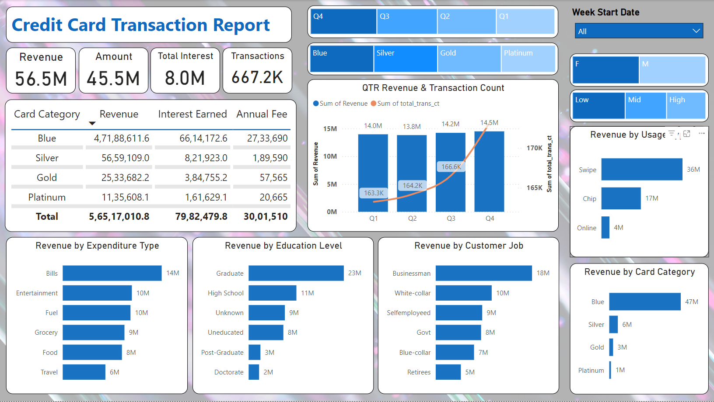
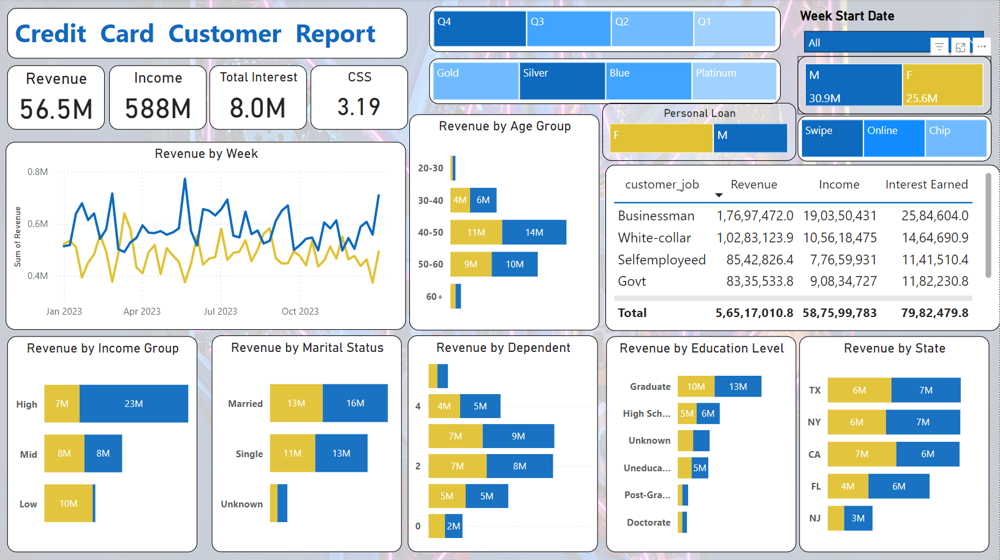

# Power BI Interactive Dashboard - Credit Card Transaction Dashboard

## Project Overview

This project analyzes credit card transactions using Power BI to provide detailed insights into customer behavior, spending categories, and card usage patterns. 
The dashboard offers a comprehensive look at revenue trends across different demographics, card types, and transaction methods, allowing for better business decision-making.




## Key Insights

- **Quarterly Revenue Growth**: The dashboard shows steady growth, with **Q4** having the highest revenue at **$14.5M** and **166.6K transactions**.
  
- **Top Spending Categories**: Bills lead as the top expenditure category with **$14M**, followed by **Entertainment ($10M)** and **Fuel ($10M)**.

- **Customer Demographics**: Graduates and Businessmen drive most of the revenue, contributing **$23M** and **$18M**, respectively.

- **Card Usage Patterns**: 
  - The **Blue card** generates the highest revenue at **$47M**.
  - **Swipe** transactions dominate, accounting for **$36M** of total revenue, surpassing both **Chip ($17M)** and **Online ($4M)** transactions.

## Technologies Used

- **Power BI**: Used for creating the dashboard and visualizing data trends.
- **Data Source**: Simulated credit card transaction data (e.g., revenue, customer demographics, card usage, etc.).

## Dashboard Features

- **Quarterly Revenue Analysis**: Visual representation of revenue and transaction count across four quarters.
- **Spending by Category**: Breakdown of revenue by key spending categories such as Bills, Entertainment, Fuel, etc.
- **Demographic Insights**: Analysis of revenue by customer education level, job type, income group, and age group.
- **Card Type Analysis**: Revenue and usage patterns across different card categories (Blue, Silver, Gold, Platinum).
- **Transaction Methods**: Comparison of revenue generated via Swipe, Chip, and Online transactions.


## Installation and Setup

1. Download **Power BI Desktop** from [here](https://powerbi.microsoft.com/desktop/).
2. Clone this repository:
    ```bash
    git clone https://github.com/your-username/madhav-store-powerbi-dashboard.git
    ```
3. Open the `.pbix` file in **Power BI Desktop**.
4. Explore the dashboard and interact with filters and slicers.

## How to Use the Dashboard

- **State-wise Analysis**: Click on the state slicer to view sales specific to that region.
- **Category-wise Insights**: Use the category filter to analyze sales based on product categories like clothing, electronics, etc.
- **Quarterly Trends**: Filter sales performance by quarters to identify patterns in different periods.
- **Payment Mode Analysis**: Understand customer payment preferences using the payment mode pie chart.

## Project Learnings

- **Data Cleaning**: Connected PostgreSQL to Power BI for seamless data import, ensuring that the raw credit card transaction data was cleaned and preprocessed effectively before visualization. This process was crucial for generating accurate and actionable insights.
  
- **Database Connection**: Leveraged PostgreSQL to handle large datasets efficiently. SQL queries were used to filter, aggregate, and manipulate the data directly in PostgreSQL, optimizing the data before it was visualized in Power BI.

- **Real-Time Data Handling**: The use of PostgreSQL allowed for easy integration of live data streams. This made it possible to update the dashboard regularly, reflecting any changes or new insights dynamically as new data was added to the database.

- **Data Visualization**: Power BI enabled the creation of clear, interactive visuals from PostgreSQL data, which helped stakeholders easily understand patterns and trends across different dimensions such as customer demographics, card usage, and spending categories.

- **Storytelling**: Beyond raw data and visuals, the integration of PostgreSQL with Power BI facilitated the creation of a narrative around customer behavior. This narrative helped drive data-driven decision-making by highlighting the most impactful areas.

- **Monitoring Future Changes**: By continuously adding new data to PostgreSQL, we were able to monitor changes and trends over time, allowing for better forecasting and adaptation of business strategies based on the evolving credit card transaction data.

## Future Enhancements
- Add predictive analytics to forecast future revenue trends.
- Incorporate real-time data integration for live updates.
- Expand demographic analysis with more granular filters (e.g., geographic location).

  
## Conclusion

This Power BI dashboard provides the Madhav Store owner with actionable insights to optimize their online sales strategy, improve inventory management, and understand customer preferences. 

Feel free to reach out for any feedback or collaboration opportunities!

## License

This project is licensed under the MIT License - see the [LICENSE](LICENSE) file for details.

## Contact

For more details or collaboration:
- **Name**: Punu N Gowda
- **Email**: punungowda6@gmail.com
- **LinkedIn**: [Punu N Gowda](https://www.linkedin.com/in/punungowda/)
